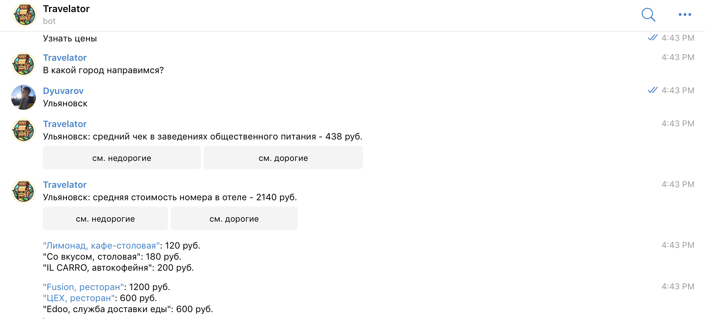

# Telegram bot TRAVELATOR

[RU :ru:](#RU)  
[EN :us:](#ENG)

### RU

## Инстументы:  
:small_blue_diamond: Java 8  
:small_blue_diamond: Spring Boot  
:small_blue_diamond: Spring Data JPA  
:small_blue_diamond: JUint test  
:small_blue_diamond: Maven  
:small_blue_diamond: PostgreSQL  
:small_blue_diamond: Telegram API  
:small_blue_diamond: 2GIS API  
:small_blue_diamond: Docker  

## Описание
Travelator  рассчитывает средний чек в заведениях общественного питания и среднюю стоимость проживания в отеле в городах России.
Кроме того, бот может показать вам примеры дорогих и недорогих заведений.  
Это может быть полезно, когда вы планируете бюджет на путешествие.  
Имя бота в telegram: @travel_cost_bot  

Данные об организациях и средних чеках предоставлены компанией 2GIS. Спасибо им :blue_heart:  

:bangbang:**Важно:** в виду ограниченного срока действия ключа API 2GIS и ограниченного количества возможных запросов, данные о заведениях и ценах берутся из файлов в 
директории answerExamples. То есть независимо от города бот всегда будет отвечать одинаково. Я сделал это специально, чтобы иметь возможность продемонстрировать работу бота 
даже после истечения срока годности моего API ключа. Имея действующий API ключ можно легко настроить бота на получение актуальных данных от 2GIS.  
  
## Как это работает
Для подключения к telegram и взаимодействия с telegram API используется библиотека [Telegrambots spring boot starter](https://github.com/rubenlagus/TelegramBots/tree/master/telegrambots-spring-boot-starter)  
Бот обрабатывает сообщения, которые вводит пользователь и реагирует на них.  
  
Когда пользователь просит рассчитать средние цены, бот обращается к API 2GIS посредством GET запроса. API несложно подменить, достаточно создать класс, который будет реализовывать интерфейс MapsAPI.  
Полученный ответ десериализуется из json в java-объекты, по найденным заведениям высчитывается средняя цена.  
  
Результаты поиска сохраняются в базе данных, это дает возможность пользователю вернуться позже и просмотреть список с примерами заведений из интересующего его города.

## Заупуск
Все что нужно для запуска - docker compose. Находясь в корневой директории используйте команду:  
1) docker-compose up  
2) Дождитесь окончания запуска.  
**Готово!**  

## Литература
* [Telegram Bot API](https://core.telegram.org/bots/api#inline-mode)  
* [2GIS API](https://docs.2gis.com/ru/api/search/places/reference/3.0/items)  
* [Статья о Telegrambots spring boot starter](https://javarush.ru/groups/posts/2959-sozdaem-telegram-bota-s-ispoljhzovaniem-spring-boot)  
* [Официальные гайды по Spring](https://spring.io/guides)  

### ENG
## Instruments  
:small_blue_diamond: Java 8  
:small_blue_diamond: Spring Boot  
:small_blue_diamond: Spring Data JPA 
:small_blue_diamond: JUint test  
:small_blue_diamond: Maven   
:small_blue_diamond: PostgreSQL  
:small_blue_diamond: Telegram API  
:small_blue_diamond: 2GIS API  
:small_blue_diamond: Docker    
  
## Description
Travelator calculates average check in cafes and hotels in Russian cities. Also, bot can show you examples of cheap and expensive establishments.  
It can be useful when you budget your trip.  
Bot's name in telegram: @travel_cost_bot  
  
Information about establishments provided py 2GIS. Thank them :blue_heart:  

:bangbang: **Important**: because the usage of 2GIS API key is limited, bot get information from files in answerExamples directory. It means regardless of the city you have chosen 
bot will always answer you same. I did it on purpose to be abel to demonstrate that bot working even if my API key will not work.  

## How it works
For working with Telegram API I am using [Telegrambots spring boot starter](https://github.com/rubenlagus/TelegramBots/tree/master/telegrambots-spring-boot-starter)  
Bot reacts on user's messages in chat.  
  
When user asks to calculate prices, bot get information from 2GIS API by GET query.  
Answer from API will be deserialized from json to java-objects. After that, average price will be calculated.
It's simple to use another API, you just need to create class that implements MapsAPI interface.  
  
Searching results stores in database, so user can later watch the examples of establishments.

## Launching
All you need to launch is docker compose. In root directory use command:  
1) docker-compose up  
2) Wait launching end  
**Done!**  

## Literature
* [Telegram Bot API](https://core.telegram.org/bots/api#inline-mode)  
* [2GIS API](https://docs.2gis.com/en/api/search/places/reference/3.0/items)  
* [Article about Telegrambots spring boot starter](https://javarush.ru/groups/posts/2959-sozdaem-telegram-bota-s-ispoljhzovaniem-spring-boot)  
* [Oficial Spring guides](https://spring.io/guides)  
